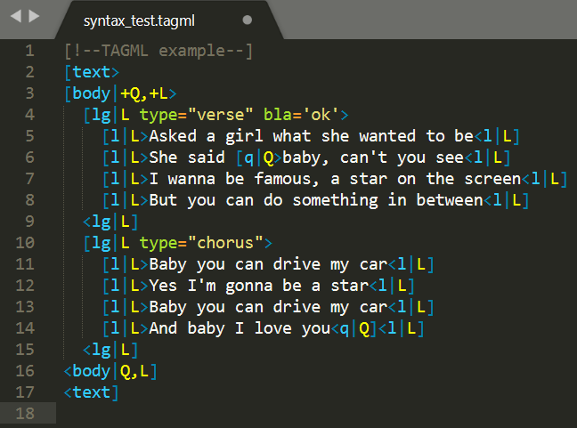

# tagml-sublime-syntax
Sublime Syntax for [TAGML](https://github.com/HuygensING/TAG/tree/master/TAGML)

We've created a syntax highlighting package for Sublime Text to make it easier to use TAGML. We advise you to use the Package Control installation (instructions below). If you encounter any problems, please send us a [message](mailto:research-development@di.huc.knaw.nl).

## Installation

### With [Package Control](https://packagecontrol.io/installation):

1. Open Sublime Text and find the Command Pallette (`ctrl+shift+p` on Windows, `cmd+shift+p` on Mac).
1. Type the `Package Control: Install Package` command in the dropdown menu and press `enter` to find and install the TAGML plugin.
1. Restart Sublime Text.
1. In Preferences > Color Scheme, find the `MonokaiFreeTAGML` Color Scheme to get the optimal syntax highlighting for TAGML files.
1. Open a new file in Sublime Text and select the `TAGML` encoding in the lower right corner of the window.

### Manually:

If the Package Control option doesn't work, you can also install the package manually:

1. Clone or download the git repo into your packages folder (in Sublime Text, find Browse Packages… menu item to open this folder)
1. Restart Sublime Text editor (if required)
1. Use the enclosed `MonokaiFreeTAGML` Color Scheme to get the optimal syntax highlighting for tagml files.
1. Open a new file in Sublime Text and select the `TAGML` encoding in the lower right corner of the window.

## Screenshot (using the MonokaiFreeTAGML theme)
