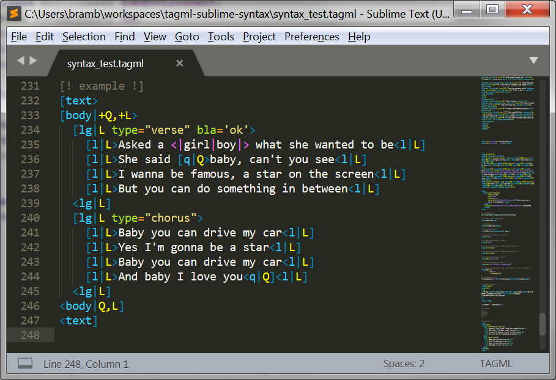

# tagml-sublime-syntax
Sublime Syntax for [TAGML](https://github.com/HuygensING/TAG/tree/master/TAGML)

## Installation

### With Package Control:

1. Run the `Package Control: Install Package` command, find and install the TAGML plugin.
1. Restart Sublime Text (if required)
1. Use the enclosed `MonokaiFreeTAGML` Color Scheme to get the optimal syntax highlighting for tagml files.
1. Open a `.tagml` file

### Manually:

1. Clone or download the git repo into your packages folder (in Sublime Text, find Browse Packages… menu item to open this folder)
1. Restart Sublime Text editor (if required)
1. Use the enclosed `MonokaiFreeTAGML` Color Scheme to get the optimal syntax highlighting for tagml files.
1. Open a `.tagml` file

## Screenshot (using the MonokaiFreeTAGML theme)
